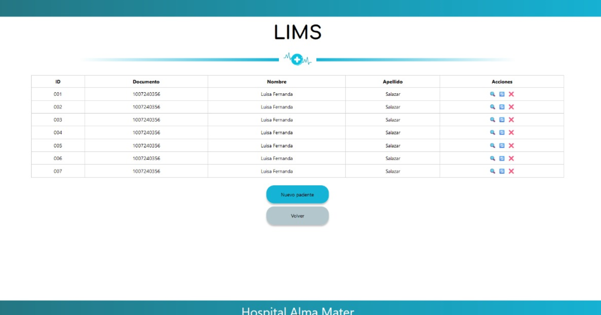

# Lipid Profile Laboratory Information Management System (LIMS)

## 📋 Table of Contents

- [Overview](#overview)
- [Features](#features)
- [Tech Stack](#tech-stack)
- [Project Structure](#project-structure)
- [Getting Started](#getting-started)
- [Default Login Credentials](#default-login)
- [API Documentation](#api-documentation)
- [Interface Visualization](#visualization)

## Overview

A web-based Laboratory Information Management System (LIMS) specifically designed for lipid profile testing and result
management. This system enables efficient management of patient data and lipid profile test results through three main
modules:

- Patient registration and test result entry
- Specialist laboratory result management
- Patient result consultation

## Features

### 1. Patient Management

- ✅ Automatic generation of consecutive patient codes
- ✅ Storage of patient demographic information
- ✅ Recording of lipid profile test results:
    - Total Cholesterol (CHOLT)
    - High-Density Lipoproteins (HDL)
    - Low-Density Lipoproteins (LDL)
    - Triglycerides (TRIG)

### 2. Laboratory Specialist Interface

- 🔍 View all patient records
- 📝 Access detailed patient information
- 🔄 Update patient information and test results
- 🗑 Delete patient records

### 3. Patient Result Consultation

- 🔎 Self-service result checking using ID number

## 🛠 Tech Stack

### Frontend

- 🎨 Vue.js
- 🎠 javascript.js

### Backend

- 🚀 Node.js 18.16.0 LTS
- 📦 MongoDB 7.0.0 LTS

### Development Tools

- 📝 VS Code
- 🐙 Git & GitHub
- 🧪 Compas for testing API

### Additional Libraries & Tools

- 📡 Axios for HTTP requests

## Project Structure


## 🚀 Getting Started

### Prerequisites

- Node.js 18.16.0 or higher
- MongoDB 7.0.0 or higher
- MongoDB Compass or any other MongoDB management tool

### Installation Steps

1. Clone the repository
   bash
   git clone https://github.com/yourusername/lipid-profile-lims.git

2. Run the frontend

```bash
cd .\frontend\
npm i
npm run dev
```

3. Make sure MongoDB is running on your local machine:

```bash
mongod
```

4. Run the backend in a new terminal window

```bash
cd .\backend\
npm i
npm run dev
```

5. Open your browser and navigate to http://localhost:8080

### Optional: Seed the Database

To populate the database with sample data, go to your mongoDB management tool (MongoDB Compass is recommended) and
import the Json files from the /backend/DB_seeds folder.

To import the data, follow these steps:

1. Open MongoDB Compass
2. Connect to your local MongoDB instance
3. Click on the database you want to import the data to
4. Go to the "patients" collection
5. Click on the "Add Data" button and select "Import JSON"
6. Select the LIMS.patients.json file from the /backend/DB_seeds folder
7. Go to the "results" collection
8. Click on the "Add Data" button and select "Import JSON"
9. Select the LIMS.results.json file from the /backend/DB_seeds folder

## 🔐 Default Login Credentials

For specialist access to the software, use the following pre-defined credentials:

- 🔒Username: admin
- 🔒Password: admin

## 💾 API Documentation

### Database Schema

The LIMS uses MongoDB to store patient and test result data. Here's an example of the data structure:

```
{
  "_id": {
    "$oid": "67067fb292efb9a595cb2aa0"
  },
  "patient": {
    "_id": "670544b5dba4ed0bd4b2e1f",
    "firstName": "Emmanuel",
    "lastName": "Arizabaleta",
    "age": 22,
    "gender": "M",
    "legalID": "1",
    "createdAt": "2024-10-08T14:41:57.837Z",
    "updatedAt": "2024-10-08T14:41:57.837Z",
    "results": [
      {
        "_id": "67054e5c59d7ad83a5c28a",
        "CHOL": "b",
        "TRIG": "a",
        "HDL": "c",
        "LDL": "d",
        "patient": "670544b5dba4ed0bd4b2e1f",
        "createdAt": "2024-10-08T15:23:10.792Z",
        "updatedAt": "2024-10-08T15:23:10.792Z"
      }
    ]
  }
}
```

This schema shows:

Patient information including:

- name
- age
- gender
- legal ID

Embedded test results with values for:

- CHOL
- TRIG
- HDL
- LDL

Timestamps for creation and updates of both patient and result records

## 🖥️ Interface Visualization

Our LIMS features an intuitive and user-friendly interface. Below are the key windows of the system:

### 1. Login Screen


The entry point for all users. Specialists can log in here using their credentials.

### 2. Patient Registration


Where new patient information is entered into the system.

### 3. Test Results Entry


Specialists can input lipid profile test results for patients here.

### 4. Patient Records View


A comprehensive view of all patient records for specialists.

### 5. Add a new patient


The specialist can add a new patient with the results.

### 6. Patient Self-Service Portal


Where patients can check their own test results using their ID.

*Note: These images are for illustration purposes. The actual interface may vary slightly based on the most recent
updates.*